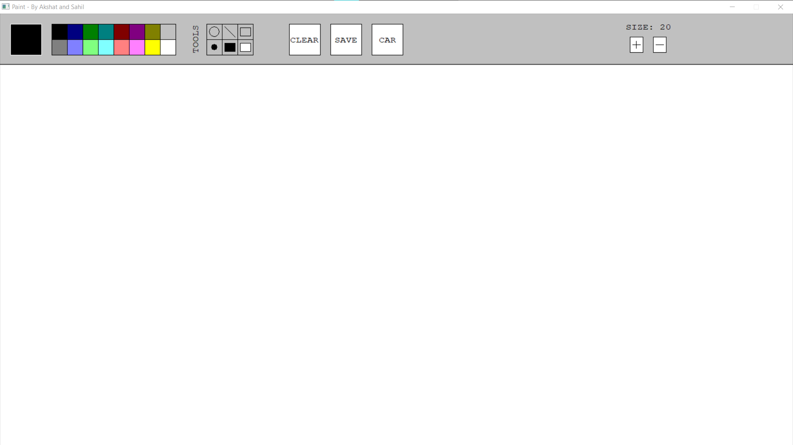
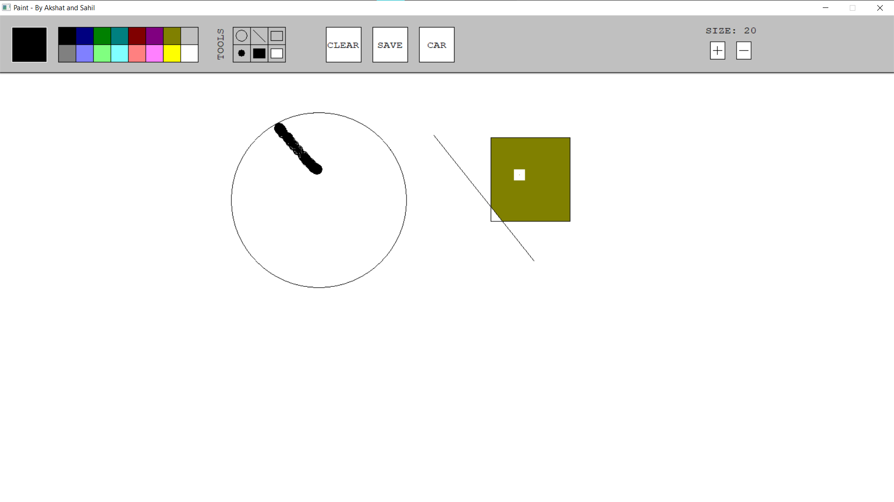
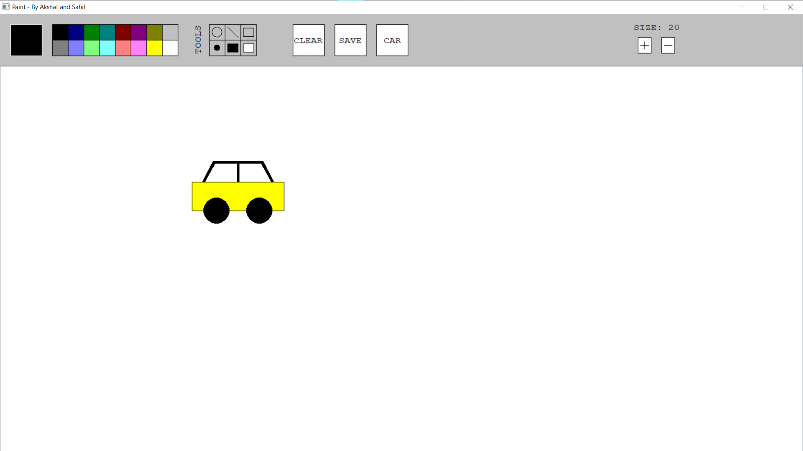

# Paint-Application

This is a paint application that allows you to draw various shapes and patterns on the screen. The project is made using the `graphics.h` library and it provides a wide range of features for drawing and painting. Here are the features of the paint application:

## Features

- Choose the current color for drawing shapes or using brush using the different colors in Color box.
- Draw circles, lines, and rectangles.
- Use brush tool.
- Use fill tool to fill colors into a drawn shape.
- Use eraser tool to erase colored areas.
- Clear the screen using the clear button.
- Save the current drawing as `save.jpg` using the save button.
- Animate a car on the screen using the car button.
- Increase or decrease the size of the eraser or brush tool using `+` and `-` buttons.

## Preview

The Paint Application

Drawing made using different tools.

The animated car after you click the `car` button, and define the animation path by dragging and dropping.

## Installation

1. Install the `graphics.h` library from [here](https://github.com/ullaskunder3/Solution-to-graphics.h).
2. Clone this github repository.
3. Build the `main.cpp` file using the `C/C++: Build .exe` task defined in `./.vscode/tasks.json`.

## Usage

To use the paint application, you can simply run the generated `a.exe` file after you build `main.cpp`. The application will open in a new window, and you can start drawing using the various tools and features available.

## Credits

This project was developed by the collaborative effort of Akshat and Sahil.
